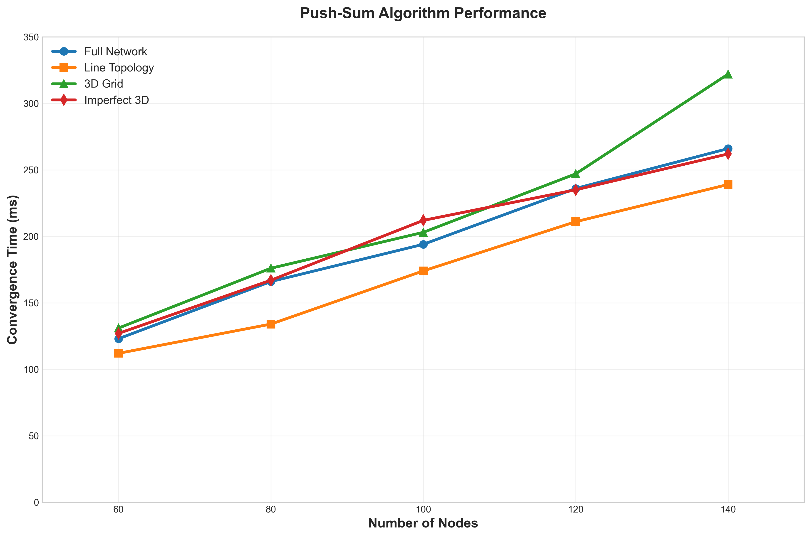
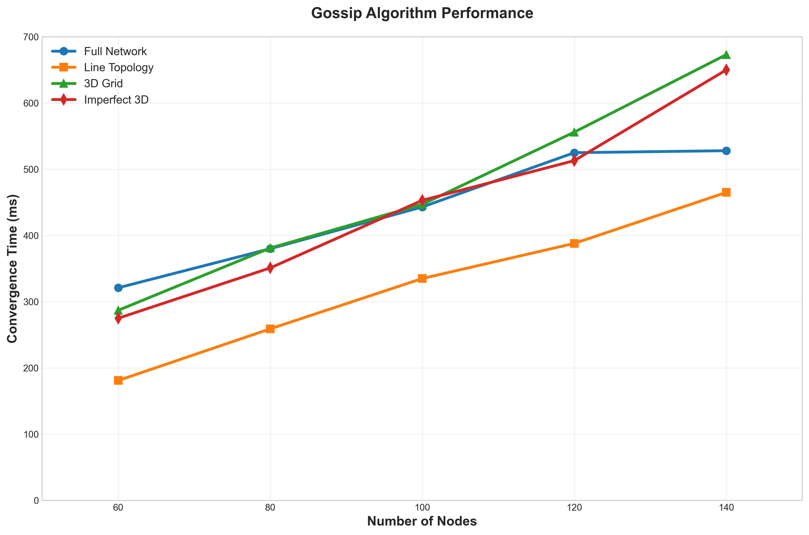

# Gossip and Push-Sum Protocols: Convergence Time Analysis

This project implements and analyzes the convergence time of the **Gossip** and **Push-Sum** algorithms on various network topologies using the Gleam language.

## Experimental Setup

- **Algorithms:** Gossip, Push-Sum
- **Topologies:** Full Network, Line, 3D Grid, Imperfect 3D
- **Network Sizes:** Multiple (e.g., 60, 80, 100, 120, 140 nodes)
- **Platform:** Gleam/Erlang on BEAM VM

## Gleam Packages Used

The following Gleam packages are used in this project:

- gleam_stdlib: Core standard library for Gleam, providing essential data structures and functions.
- gleam_otp: Provides OTP (Open Telecom Platform) abstractions for building concurrent and fault-tolerant applications.
- gleam_erlang: Enables interoperability with Erlang and access to BEAM-specific features.
- gleeunit: (dev dependency) Used for writing and running tests in Gleam.

## Project Modules Overview

- **project2_gossip.gleam**: Main entry point for running the project and orchestrating the simulation.
- **boss.gleam**: Coordinates the actors and manages the execution of the protocols.
- **node.gleam**: Defines the behavior and state of individual nodes in the network.
- **topology.gleam**: Handles the creation and management of different network topologies.
- simple_gossip.gleam: Contains a simplified or helper implementation of the gossip protocol.
- time_util.gleam: Provides utility functions for timing and measuring performance.
- argv.gleam: Handles parsing of command-line arguments for the application.

## Results: Convergence Time vs. Network Size

For each algorithm, we plot the convergence time as a function of network size for all four topologies. Each graph overlays the four topologies for direct comparison. We collected 40 result sets and plotted the graph using a python script.

### Push-Sum Algorithm



- The Push-Sum algorithm demonstrates a clear trend of increasing   convergence time as the network size grows, but the rate of increase varies significantly across different topologies.
- The line topology consistently achieves the fastest convergence, while the 3D grid shows noticeably higher convergence times, especially at larger network sizes.
- The full network topology performs well for smaller sizes but does not scale as efficiently as the line topology, highlighting the impact of network structure on distributed algorithm performance.

### Gossip Algorithm



- The convergence time for the Gossip algorithm rises sharply as the network size increases, indicating that scalability is a significant challenge for this protocol.
- Among all topologies, the line topology consistently achieves the fastest convergence, while the 3D grid and imperfect 3D topologies show much slower convergence, especially at larger network sizes.
- The full network topology starts with relatively low convergence times for small networks but hits a threshold cap much earlier at higher node count as compared to other topologies.


## Largest Network Size Managed

The largest network size successfully managed for each topology and algorithm is as follows:

| Algorithm  | Full Network  | Line Topology | 3D Grid | Imperfect 3D |
|------------|---------------|---------------|---------|--------------|
| Gossip     |  2500         |  3000         | 3000    | 3000         |
| Push-Sum   |  10000        |  10000        | 10000   | 10000        |

*Note: For Push-Sum, the implementation was able to handle up to 10000 nodes, while for Gossip the maximum tested was 3000 nodes.*

## Key Findings

- The network structure really matters. As the number of nodes grows, convergence slows down, but the effect is different depending on the topology.

- The line topology surprised me by being the most consistent and scaling the best overall, while the full network wasn’t as efficient as I expected when the network got bigger.

- The 3D and imperfect 3D topologies worked, but they tended to slow things down compared to line or full, especially as the system grew.

- Between the two algorithms, Push-Sum clearly converges faster and can handle much larger networks than Gossip.

- The data also suggests that Push-Sum sometimes follows a sub-linear growth pattern, which is why it scales much better in larger setups compared to Gossip.

## Usage

```bash
# Build the project
gleam build

# Run gossip algorithm
gleam run -m project2_gossip <nodes> <topology> gossip

# Run push-sum algorithm
gleam run -m project2_gossip <nodes> <topology> push-sum

# Example:
gleam run -m project2_gossip 100 full gossip
gleam run -m project2_gossip 60 line push-sum
```

- `<nodes>`: Number of nodes (e.g., 60, 80, 100, 120, 140)
- `<topology>`: `full`, `line`, `3D`, `imp3D`
- `<algorithm>`: `gossip`, `push-sum`

## Team Members

- Samarth Vinayaka (UFID - 99665198)
- Pulkit Garg (UFID - 31125456)
